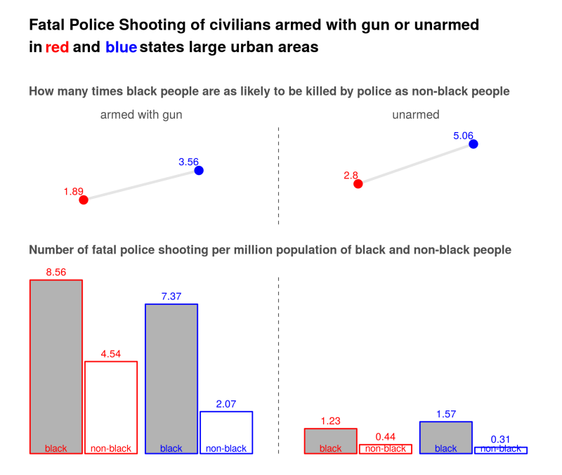

# Fatal Police Shooting: Blue States Are Deadly for Black People
This project analyzes the [Washington Post police shooting database](https://github.com/washingtonpost/data-police-shootings) of civilians shot and killed by on-duty police officers in the United States in year 2015 and 2016. 

## Summary
About 1000 civilians are shot and killed by police officers each year in the United States. Black people are more than twice as likely to be killed as non-black people. Racism is often blamed for this disparity. 

If racism does play a role, we would expect smaller disparity in blue states than in red states, as black people are believed to face less discrimination in blue states. 

Surprisingly, the analysis of the Washington Post shooting database shows that the disparity is much larger in blue states than in red states. If we use this disparity as a measure of racism, blue states discriminate against black people more than red states do. 

## Results
### Disparity is larger in blue states than in red states

We divide the 50 states and DC into two groups, blue states and red states, using vote for Obama in 2012 presidential election. As Obama is a black people, this data better represents racial issues than the most recent 2016 election data. A state is a blue state if 50% or more voted for Obama, and is a red state otherwise. We use 50% vote as the criteria instead of Obama winning, because all other candidates are non-blacks.

The disparity ratio and number of fatal police shooting per million population in the two groups are calcualted for the year 2015 and 2016. The disparity ratio is defined as the ratio of the number of fatal police shooting per million black population to that of per million non-black people. For example, the disparity ratio is 2 when 10 out of one million black people and 5 out of one million non-black people are killed.

The disparity ratio is much higher in blue states than in red states. In red states, black people are 1.68 times as likely to be killed by police as non-black people. The disparity ratio nearly doubles to 3.26 in blue states, which is partially attributed to black people being more likely to be killed, but mainly is accounted for by less likely non-black people being fatally shot in blue states. In blue states, 13.59 per million black people were killed, 20% more than that in red state (11.32 per million). In blue state, 4.17 per million non-black people were killed, 40% less than that in red states (6.73 per million). 

One may argue that higher disparity in blue states could be result of higher urbanization rate in blue states. It is true that black people tend to concentrate in large urban area in blue states. Accoding to 2010 census, 93% black people lived in a large urban area, which is defined as an urban area with more than 50,000 population. This percent is only 71% in red states. Generally speaking, police are more likely to shoot in large urban areas than in rural and small urban. A fair comparison should compare the disparity in large different areas seperately.

The calculation shows that in large urban area, which accounts for 92% of black people killed, the disparity ratio is still much higher in blue state than in red states. The disparity ratio is 1.94 in red states and 3.07 in blue states. Almost all the difference is attributed to fewer non-black people being killed in blue states (4.49 per million) than in red states (7.25 per million). Black people are equally likely to be killed in both blue states and red states in large urban areas. 

The difference disparity ratio is even higher in rural and small urban areas. While black people are 3.29 times as likely to be killed as non-black people in blue states, black people are 0.77 times, actually less likely to be killed by police as non-black people. However, only about 8% cases of black people killed occurred in rural and small urban area.

### Disparity in individual states
We will pay attention to large urban area of significant states with more than 300,000 black population, or with more than 3 black people killed by police. 

The bluer the state, the larger the disparity ratio. Disparity ratio has a clear uptrend when plotted against the vote for Obama in 2012 presidential election. The traditional blue states such as Illinois, Massachusetts, and New York double the disparity ratio of the national average. Washington D.C. makes an extreme case - all 8 people killed by police in 2015 and 2016 are black people, while only half the population are blacks. California is better but still higher than the national average. On the other hand, most states below the national average are red states, including Texas, Gorgia, Alabama, and Tennessee.

### Armed with gun and Unarmed
Racism increases the likelyhood of black people being shoting by police officer in two ways [538 refs?]. First, it causes bias among individual police officers, which makes them more likely to shoot at black people when facing the same level of threat. Second, it leads to more police interactions with black people. For example, racism is behind systemic police practices such as car stop that single out black people; racism is also behind social issues including urban poverty that leads to higher crime rate among black people. 

Examining the weapon a civillian was carrying when shot dead by police officer, in particular, carrying a gun and unarmed, tells more about the roles of racism in police shooting. Police officers have to shoot at a civillian armed with a gun to protect themselves and others no matter the civillian is black or not. Bias of individual police plays no role in this situation and therefore the disparity is soly the result of more police interaction with black people. Bias of individual police plays more role when an unarmed civillian is shot, as the police officers face little real threat but shoot out of fear and misjudgement. 

Let's look at the disparity ratios of civillian armed with a gun shot and killed by police in red and blue states. Again the disparity ratio is much higher in blue states than in red states. As discussed above, the ratios can be interpreted as how many times as likely a black people encountered a police officer as a non-black people. The ratios then suggest that black people are 1.89 times as likely to be approached by police officer as non-black people in red stats and 3.56 times in blue states.

Bias among individual police officers is expected to add up to the disparity when the civillians are unarmed. Indeed, the disparity ratio jumps 2.8 in red states and to an astonishing 5.06 in blue states. This number 

## Data preparation
### Fatal police shooting in larger urban area, small urban area, and rural area
The location of the shootings provided in the Washington Post database is down to city/town level. We do not know whether it is a larger urban area, small urban area, or rural area. In order to identify the nature of the location, we plot the shooting on top of population map. The map, which is produced using 2010 national census data, shows the region of large urban, small urban, and rural areas. Eyeballing the map, we can count easily the number of shooting in small urban areas and rural areas. The remaining shooting cases are in large urban areas.

The count of fatal shooting in small urban area and rural area may not be accurate. As the location is only down to the city or town level, some shooting that took place in rural area will be marked as urban area, unless the city/town itself belongs to rural area. We need more detailed location information to get reliable count. 

This miscount, however, does not significantly affect the count of shooting in large urban area. The combined count in rural and small urban area is also reliable. 
 

_Number of black / non-black people fatally shot by police in blue states and red states_

|           | large urban area | small urban area | rural area |
|-----------|:----------------:|:----------------:|:----------:|
|blue states| 281 / 596        | 14 / 69          | 1 / 65     |
|red states | 171 / 296        | 20 / 131         | 3 / 112    |
