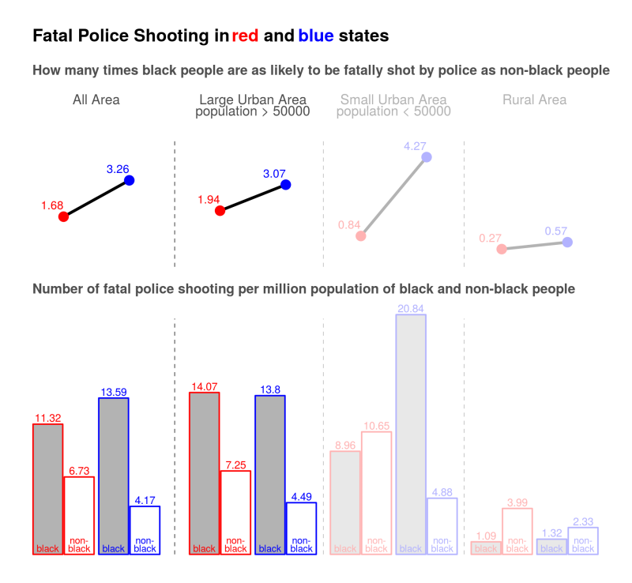
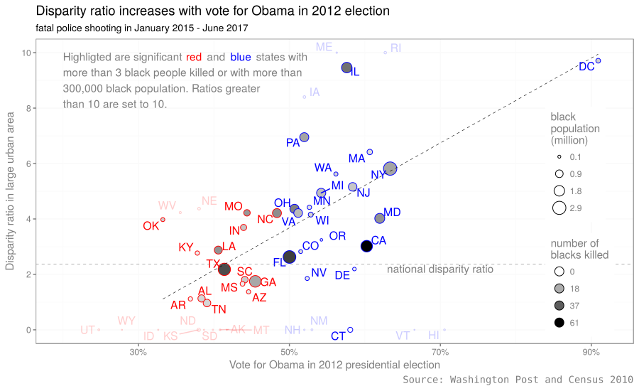
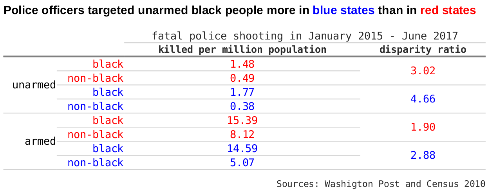
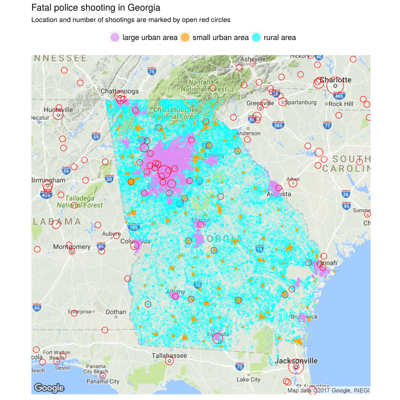
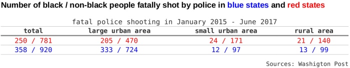

# Black people are more likely to be killed by police, but do not blame racism
This project analyzes the [Washington Post police shooting database](https://github.com/washingtonpost/data-police-shootings) of civilians shot and killed by on-duty police officers in the United States from January 2015 to June 2017. 

## Introduction
Black people are more than twice as likely to be shot and killed by police officers as non-black people. In the two an half years from January 2015 to June 2017, 2452 people were fatally shot by on-duty police officers, as recorded in the Washington Post police shooting database. Among those killed whose races are known, 26.3% are black people, while black people are only [13.3% of the total population](https://www.census.gov/quickfacts/), that is, black people are 2.33 times as likely to be killed as non-black people. 

Racism has been blamed for this disparity and it is not without reason. After years of fighting for equality, explicit racism has been much eliminated from written laws and policies. It is, however, still wide spread in people's minds as prejudice. In addition, implicit racism is still exists in the practices of organizations and institutions. Racism increases the likelihood of black people being shot by police officers.  First, it causes bias among individual police officers, which makes them more likely to shoot at black people when facing the same level of threat. Second, it leads to more police interactions with black people. For example, racism is behind systemic police practices such as car stop that single out black people; racism is also behind social issues including urban poverty that leads to higher crime rate among black people.  

The question is how to prove that racism is the major cause of the disparity in police shooting. This is not a question to be answered lightly. Instead we examine a more specific hypothesis derived from the question: if racism does play a major role, we would expect smaller disparity in blue states than in red states, as black people are believed to face less discrimination in blue states. The Washington Post police shooting database provides opportunity to test this hypothesis.

Surprisingly, the analysis of the shooting database completely contradicts to the hypothesis: the disparity is actually much larger, rather than smaller, in blue states than in red states. In large urban areas, black people are 1.96 time as likely to be fatally shot by police as non-black people in red states while it is 3.00 times in blue states. For those unarmed victims, the disparity is 3.02 in red states and as high as 4.66 in blue states. 

This result unexpectedly disproves the theory that racism is to blame for black people being more likely to be shot and killed by police officer than non-black people. There must be other reasons behind the large disparity.

This project presents the analytic result showing that blue states have larger disparity than red states. Possible causes will be discussed in next project.

## Results
### Disparity is larger in blue states than in red states

We divide the 50 states and DC into two groups, blue states and red states, using vote for Obama in 2012 presidential election. As Obama is a black people, this data better represents racial issues than the most recent 2016 election data. A state is a blue state if 50% or more voted for Obama, and is a red state otherwise. We use 50% vote as the criteria instead of Obama winning, because all other candidates are non-blacks.

The disparity ratio and number of fatal police shooting per million population are calculated for the two and half years since 2015. The disparity ratio is defined as the ratio of the number of fatal police shooting per million black population to that of per million non-black people. For example, the disparity ratio is 2 when 10 out of one million black people and 5 out of one million non-black people are killed.

The calculation shows that the disparity ratio is much higher in blue states than in red states. In red states, black people are 1.77 times as likely to be killed by police as non-black people. The disparity ratio increases to 3.12 in blue states, which is partially attributed to black people being more likely to be killed, but mainly is accounted for by less likely non-black people being fatally shot in blue states. There are 16.43 per million black people were killed in blue states, 13% more than that in red state (14.59 per million) and 5.26 per million non-black people were killed in blue states, 36% fewer than that in red states (8.22 per million). 

One may argue that higher disparity in blue states could be the result of their higher urbanization rate. It is true that black people tend to concentrate in large urban area in blue states. A large urban area is defined as an urban area with more than 50,000 population. According to 2010 census, 93% black people lived in large urban areas in blue state, while only 71% in red states. Generally people believe that police are more likely to shoot in large urban areas than in rural and small urban areas. A fair comparison should compare the disparity in different areas separately.

The re-calculation, however, shows that in large urban area the disparity ratio is still much higher in blue state than in red states. The disparity ratio is 1.96 in red states and 3.00 in blue states. Almost all the difference is attributed to fewer non-black people being killed in blue states (5.45 per million) than in red states (8.61 per million). Black people are equally likely to be killed in both blue states and red states in large urban areas. 

The difference in disparity ratio is even higher in rural and small urban areas. While black people are 3.75 times as likely to be killed as non-black people in blue states, black people are only 1.17 times, almost equally likely to be killed by police as non-black people in red states. 

### The bluer the state, the larger the disparity
Now let's examine the disparity in individual states. We will focus on large urban areas of significant states with more than 300,000 black population, or with more than 3 black people killed by police. Otherwise, the calculated disparity ratio is greatly altered by a single random case and therefore less informative.

Of these significant states, the disparity ratio has a clear uptrend when plotted against the vote for Obama in 2012 presidential election. The traditional blue states such as Illinois, Massachusetts, and New York more than double the disparity ratio of the national average. In particular, 57.6% killed in Illinois are black people, while only 14.5% population are blacks. In Washington D.C., 10 out of 11 killed by police are black people, and half the population are blacks. California is better but still higher than the national average. On the other hand, most states below the national average are red states, including Texas, Georgia, Alabama, and Tennessee.

### Unarmed black people are 4.66 times as likely to be killed in large urban areas of blue states
Unarmed civilians shot and killed by police officers are of particular importance in analyzing the role of racism in police shooting. Police officers are more justified to shoot at an armed people to protect themselves or others no matter of his skin color. Bias of individual police plays little role in this situation and therefore the disparity is largely the result of more police interaction with black people. Bias of individual police plays more role when an unarmed civilian is shot, as the police officers face little real threat but shoot out of fear and misjudgment. Killing of unarmed black people are more likely to spark social unrest like what happened in Ferguson, Missouri in 2014 for [the killing of Michael Brown](https://en.wikipedia.org/wiki/Shooting_of_Michael_Brown).

Again, blue states see a much larger disparity, as large as 4.66, compared to 3.02 in red states. As discussed above, bias among individual police officers is expected to add up to the disparity when the civilians are unarmed. Indeed, the disparity ratio are only 1.90 in red states and 2.88 in blue states respectively when the victims are armed. Both are significantly lower than the unarmed cases. 

## Data preparation
### Fatal police shooting in large urban area, small urban area, and rural area
We use 2010 national census data to determine weather a shooting location is a large urban area, small urban area, or rural area. The census data assigns each census block to one of three types of geo-components: urbanized area (large urban area), urban cluster (small urban area) and rural area. The location of the shootings provided in the Washington Post database is down to city/town level. The geo-component of a shooting location is determined by the geo-component of the closest census block to the city/town.

The determination of shootings in small urban area and rural area may not be accurate. As the location is only down to the city or town level, some shooting that took place in rural area will be marked as small urban area, unless the city/town itself belongs to a rural area. We need more detailed location information to get reliable count. 

This miscount, however, does not affect the count of shooting in large urban area. The combined count in rural and small urban area is also reliable. 

