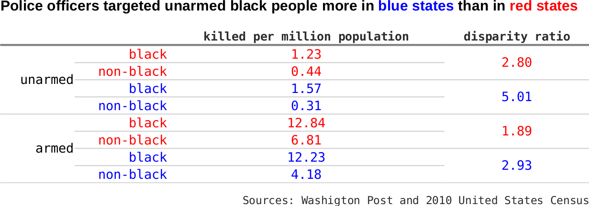

# Black people are more likely to be killed by police, but do not blame racism
This project analyzes the [Washington Post police shooting database](https://github.com/washingtonpost/data-police-shootings) of civilians shot and killed by on-duty police officers in the United States in year 2015 and 2016. 

## Introduction
Black people are more than twice as likely to be shot and killed by police officers as non-black people. In 2015-2016, 1948 people were fatally shot by on-duty police officers, as recorded in the Washington Post police shooting database. Among those killed of known race, 26.3% are black people, while black people are only [13.3% of the total population](https://www.census.gov/quickfacts/). 

It is reasonable to blame racism for this disparity. After years of fighting for equallity, explicit racism has been much eliminated from written laws and policies. It is, however, still wide spread in people's minds as prejudice. In addition, inplicit racism is still exists in the practices of organizations and institutions. We can even image how racism increases the likelihood of black people being shot by police officer.  First, it causes bias among individual police officers, which makes them more likely to shoot at black people when facing the same level of threat. Second, it leads to more police interactions with black people. For example, racism is behind systemic police practices such as car stop that single out black people; racism is also behind social issues including urban poverty that leads to higher crime rate among black people.  

Now the question is how to prove that racism is the major cause of the disparity. This is not a question to be answered lightly. Instead we examine a more specific hypothesis derived from the quesiton: if racism does play a role, we would expect smaller disparity in blue states than in red states, as black people are believed to face less discrimination in blue states. The Washington Post police shooting database provides opportunity to test this hypothesis.

Surprisingly, the analysis of the shooting database completely contradicts to the hypothesis: the disparity is actually much larger, instead of smaller, in blue states than in red states. In large urban areas, black people are 1.94 time as likely to be fatally shot by police as non-black people in red states while it is 3.07 times in blue states. For those unarmed victims, the disparity is 2.80 in red states and as high as 5.01 in blue states. 

This result unexpectely disproves the theory that racism is to blame for the large disparity of black people being killed by police. There must be other reasons behind the large disparity.

## Results
### Disparity is larger in blue states than in red states

We divide the 50 states and DC into two groups, blue states and red states, using vote for Obama in 2012 presidential election. As Obama is a black people, this data better represents racial issues than the most recent 2016 election data. A state is a blue state if 50% or more voted for Obama, and is a red state otherwise. We use 50% vote as the criteria instead of Obama winning, because all other candidates are non-blacks.

The disparity ratio and number of fatal police shooting per million population in the two groups are calculated for the year 2015 and 2016. The disparity ratio is defined as the ratio of the number of fatal police shooting per million black population to that of per million non-black people. For example, the disparity ratio is 2 when 10 out of one million black people and 5 out of one million non-black people are killed.

The calculation shows that the disparity ratio is much higher in blue states than in red states. In red states, black people are 1.68 times as likely to be killed by police as non-black people. The disparity ratio nearly doubles to 3.26 in blue states, which is partially attributed to black people being more likely to be killed, but mainly is accounted for by less likely non-black people being fatally shot in blue states. In blue states, 13.59 per million black people were killed, 20% more than that in red state (11.32 per million). In blue state, 4.17 per million non-black people were killed, 40% less than that in red states (6.73 per million). 

One may argue that higher disparity in blue states could be the result of higher urbanization rate in blue states. It is true that black people tend to concentrate in large urban area in blue states. According to 2010 census, 93% black people lived in a large urban area, which is defined as an urban area with more than 50,000 population. This percent is only 71% in red states. Generally speaking, police are more likely to shoot in large urban areas than in rural and small urban areas. A fair comparison should compare the disparity in different areas separately.

The re-calculation shows that in large urban area, which accounts for 92% of black people killed, the disparity ratio is still much higher in blue state than in red states. The disparity ratio is 1.94 in red states and 3.07 in blue states. Almost all the difference is attributed to fewer non-black people being killed in blue states (4.49 per million) than in red states (7.25 per million). Black people are equally likely to be killed in both blue states and red states in large urban areas. 

The difference in disparity ratio is even higher in rural and small urban areas. While black people are 3.29 times as likely to be killed as non-black people in blue states, black people are 0.77 times, actually less likely to be killed by police as non-black people. However, only about 8% cases of black people killed occurred in rural and small urban areas.

***
In title say in year 2015 and 2016xxxxxxxxxxxxxx
also reconsider titles and subtitle to make them more conclusive

### The bluer the state, the larger the disparity
In the following analysis, we will focus on large urban areas of significant states with more than 300,000 black population, or with more than 3 black people killed by police. 

Disparity ratio has a clear uptrend when plotted against the vote for Obama in 2012 presidential election. The traditional blue states such as Illinois, Massachusetts, and New York double the disparity ratio of the national average. Washington D.C. makes an extreme case - all 8 people killed by police in 2015 and 2016 are black people, while only half the population are blacks. California is better but still higher than the national average. On the other hand, most states below the national average are red states, including Texas, Georgia, Alabama, and Tennessee.

***

### Unarmed black people are 5 times as likely to be killed as non-black people in large urban areas in blue states
Unarmed civilians shot and killed by police officers are of particular importance when analyzing the role of racism in police shooting. Police officers are more justified to shoot at a armed civilian to protect themselves and others no matter the civilian is black or not. Bias of individual police plays less role in this situation and therefore the disparity is more of the result of more police interaction with black people. Bias of individual police plays more role when an unarmed civilian is shot, as the police officers face little real threat but shoot out of fear and misjudgment. Indeed, killing of unarmed black people are more likely sparks social unrest like what happened in Ferguson, Missouri in 2014 for killing of Michael Brown.

Let's look at the disparity ratios of unarmed civilians killed by police in red and blue states. As discussed above, bias among individual police officers is expected to add up to the disparity when the civilians are unarmed. Indeed, the disparity ratio jumps to 2.8 in red states and to an astonishing 5.06 in blue states. These numbers are much higher than those of armed civilians, which are 1.89 and 2.93 respectively.

More importantly, bias among individual police officers are more severe in blue states than in red states. In blue states, the disparity ratio in the case of unarmed civilians is 71% higher than in armed civilian, while it is only 48% higher in red states. 

***

## Why blue states have much larger disparity
Appearently racism is not the reason that blue states have much larger disparity. It is reasonable to assume that racism causes disparity. Blue states, however, have less severe racism, which would lead to smaller disparity based on the assumption. If one insists and argue that racism play roles in indirectr ways, the relationship between racism and disparity must be so vague that it is better to find out more direct causes.

In order to understand why blue states have much larger disparity, we'd better first find conditions that cause disparity and then prove that particular condition is more severe in blue states than in red state. 

XXX suggested in his blog post (link) that police officer in blue states are more protected by police union and therefore less likely to be hold accountable, which caused extra brutality in blue states. If this is true it might be able to explain the larger disparity in blue states. The logic is: a small number of bad police officers committed most of the fatal shooting. In red state, they will be punished and removed from police force; those alike will be detered from doing so. In blue states, however, they are protected by police union and will have chance to do it again; those alike has no fear to do it. If this small number of police officers are strongly racial biased, blue states will have larger disparity.

Above theory, however, is built on many assumptions, and actual police union contracts does not support it. Campaign Zero, an organization???? aiming to end police brutality, has searched police contracts of the 100 largest US cities for languages that protect police officers in case of wrongdoing. The protection was assigned to six categories and the times of appearance of each category in the contract were counted. On average a city in blue states and red state has similar amount protection. Only two categories has 10-20% difference, which are unlikely to account for the huge difference in the disparity in blue and red states.

***

Broken window policing, ending which is Campaign Zero's number one solution to fight against police brutality, will for sure lead to disparity. This strategy is originated from the idea that a car or building with broken windows will be further severely damaged if not repaired promptly. Broken windows policing is to crack down on petty crimes and create a lawful envirenment in order to prevent more serious crimes. Under this strategy, more police forces are dispatched to troubled neighborehoods to prevent small crimes. Unfortunately, many black neighborehoods are included because of poverty, which increases encounter between police officers and black people. In addition, police officers tend to target black people in practicing this policy. These all lead to disparity.

If we want to confirm that broken window policing caused the much large disparity in blue states, we must find evidence that blue states practice more broken window policing or black communities have more trouble in blue states. Since New York City adopted broken windows policing in XXXX1996, many city across the Unitd States followed the suitxxx. Yet in order to reveal how it affect the disparity, we need more data and quantitative ways to describe the application of broken windows policing in each city.

## Data preparation
### Fatal police shooting in larger urban area, small urban area, and rural area
The location of the shootings provided in the Washington Post database is down to city/town level. We do not know whether it is a larger urban area, small urban area, or rural area. In order to identify the nature of the location, we plot the shooting on top of population map. The map, which is produced using 2010 national census data, shows the region of large urban, small urban, and rural areas. Eyeballing the map, we can count easily the number of shooting in small urban areas and rural areas. The remaining shooting cases are in large urban areas.

The count of fatal shooting in small urban area and rural area may not be accurate. As the location is only down to the city or town level, some shooting that took place in rural area will be marked as urban area, unless the city/town itself belongs to rural area. We need more detailed location information to get reliable count. 

This miscount, however, does not significantly affect the count of shooting in large urban area. The combined count in rural and small urban area is also reliable. 
 

_Number of black / non-black people fatally shot by police in blue states and red states_

|           | large urban area | small urban area | rural area |
|-----------|:----------------:|:----------------:|:----------:|
|blue states| 281 / 596        | 14 / 69          | 1 / 65     |
|red states | 171 / 296        | 20 / 131         | 3 / 112    |

