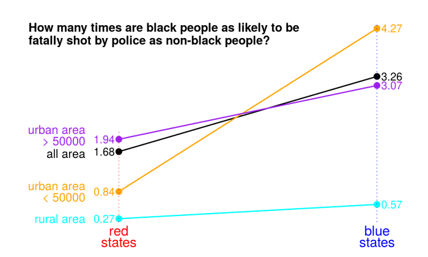

# More discrimination against black people by police officers in blue states? 
This project is to analyze the [Washington Post database](https://github.com/washingtonpost/data-police-shootings) of civilians shot and killed by on-duty police officers in the United States in year 2015 and 2016. 

## Summary
Over 1000 civilians are fatally shot by police officers in the United States each year. Black people are more than twice as likely to to killed as non-black people. Racism is often blamed for this disparity. 

If racism does play a role, we would expect smaller disparity in blue states than in red states, as black people are believed to face less discrimination in blue states. To examine this theory, we divide the 50 states and DC into two groups, blue states and red states, and calcualte the disparity in the two groups using the Washington Post database. 

Surprisingly, the calculation shows that the disparity is much larger in blue states than red states. In red states, black people are **1.68** times as likely to be killed by police as non-black people. This disparity ratio doubles to **3.26** in blue states. In large urban area with more than 50000 population, which accounts for 92% of black people killed, the disparity ratio is **1.94** in red states and **3.07** in blue states.

If we use the disparity as a measure of racism, blue states are more discriminative against black people than red states. This is against intuition and public perception. Why? This is a job for sociologist. 

