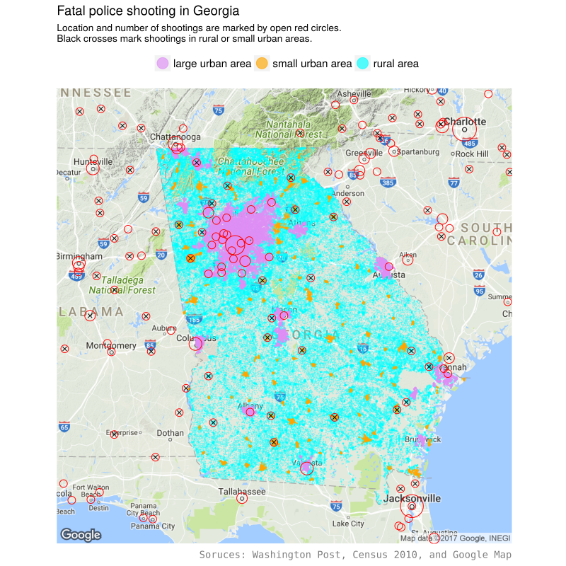

# Is there more discrimination against black people by police officers in blue states?
This project analyzes the [Washington Post database](https://github.com/washingtonpost/data-police-shootings) of civilians shot and killed by on-duty police officers in the United States in year 2015 and 2016. 

## Summary
Over 1000 civilians are shot and killed by police officers each year in the United States. Black people are more than twice as likely to to killed as non-black people. Racism is often blamed for this disparity. 

If racism does play a role, we would expect smaller disparity in blue states than in red states, as black people are believed to face less discrimination in blue states. 

Surprisingly, the analysis of the Washington Post shooting database shows that the disparity is much larger in blue states than in red states. If we use this disparity as a measure of racism, blue states discriminate against black people more than red states do. 

## Results
### Disparity in red states and blue states as two groups

We divide the 50 states and DC into two groups, blue states and red states, using vote for Obama in 2012 presidential election. As Obama is a black people, this data better represents racial issues than the most recent 2016 election data. A state is a blue state if 50% or more voted for Obama, and is a red state otherwise. We use 50% vote as the criteria instead of Obama winning because all other candidates are non-blacks.

The disparity ratio and number of fatal police shooting per million population in the two groups are calcualted. The disparity ratio is defined as the ratio of the number of fatal police shooting per million black population to that of per million non-black people. For example, the disparity ratio is 2 when the number of per million population shooting is 10 for black people and 5 for non-black people.

The disparity ratio is much higher in blue state than in red state. In red states, black people are 1.68 times as likely to be killed by police as non-black people. The disparity ratio doubles to 3.26 in blue states. The larger disparity in blue states is partially attributed to that black people is more likely to be killed, but mainly accounted for by less likely non-black people being fatally shot by police. The likelyhood of blacks being killed is 13.59 per million popultion in blue state, 20% larger than that in red state (11.32 per million). The likelyhood of non-black people being killed is 6.73 per million in red states, 61% higher than the 4.17 per million in blue states. 

One argues that higher disparity in blue states could be result of higher urbanization rate in blue states. Generally speaking, black people tend to live in large urban area in blue states where police are more likely to shoot. A fair comparison should compare the disparity in large urban area in red and blue states.

In large urban area with more than 50000 population, which accounts for 92% of black people killed, the disparity ratio is 1.94 in red states and 3.07 in blue states. Almost all the difference is attributed to fewer non-black people being killed in blue states (4.49 per million) than in red states (7.25 per million). Black people are equal likely to be killed in both blue states and red states in large urban area. 

In rural and small urban areas in red state, black people are less likely to be killed by police than non-black people (disparity ration 0.77). 

### Disparity in individual states
We will pay attention to large urban area of significant states with more than 300,000 black population, or with more than 3 black people killed by police. 

There is a clear uptrend of disparity when plotted against vote for Obama in 2012 presidential election.  The traditional blue states such as Illinois, Massachusetts, and New York double the disparity of national average. Washington D.C. makes an extreme case - all 8 people killed by police in 2015 and 2016 are black people, while only half the population are blacks. California is better but still higher than the national average. On the other hand, most states below the national average are red states, including Texas, Gorgia, Alabama, and Tennessee.

### Unarmed civilians
The disparity ratio in unarmed civilians shot and killed by police is often used as a better indicator of the role of racism in police shooting. These shooting occurred when police officers 

## Data preparation
### Fatal police shooting in larger urban area, small urban area, and rural area
The location of the shootings provided in the Washington Post database is down to city/town level. We do not know whether it is a larger urban area, small urban area, or rural area. In order to identify the nature of the location, we plot the shooting on top of population map. The map, which is produced using 2010 national census data, shows the region of large urban, small urban, and rural areas. Eyeballing the map, we can count easily the number of shooting in small urban areas and rural areas. The remaining shooting cases are in large urban areas.

The count of fatal shooting in small urban area and rural area may not be accurate. As the location is only down to the city or town level, some shooting that took place in rural area will be marked as urban area, unless the city/town itself belongs to rural area. We need more detailed location information to get reliable count. 

This miscount, however, does not significantly affect the count of shooting in large urban area. The combined count in rural and small urban area is also reliable. 
 

_Number of black / non-black people fatally shot by police in blue states and red states_

|           | large urban area | small urban area | rural area |
|-----------|:----------------:|:----------------:|:----------:|
|blue states| 281 / 596        | 14 / 69          | 1 / 65     |
|red states | 171 / 296        | 20 / 131         | 3 / 112    |
