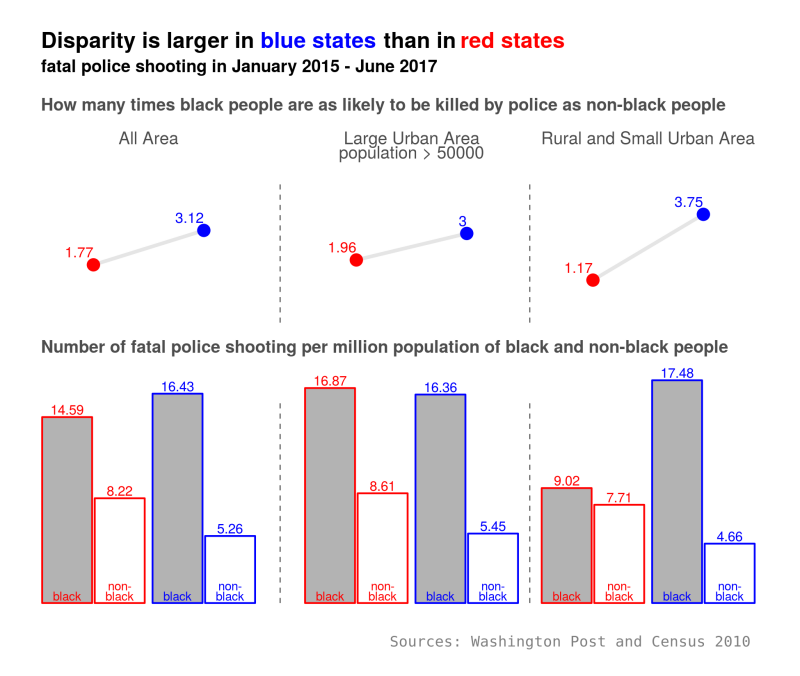
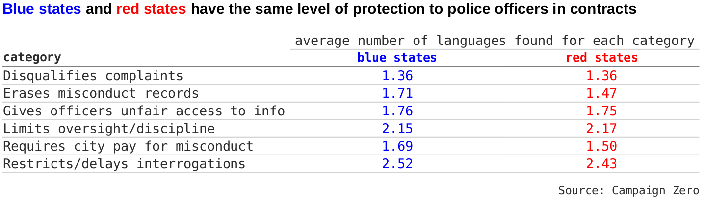

# Black people are more likely to be killed by police, but do not blame racism
This project analyzes the [Washington Post police shooting database](https://github.com/washingtonpost/data-police-shootings) of civilians shot and killed by on-duty police officers in the United States in from January 2015 to June 2017. 

## Introduction
Black people are more than twice as likely to be shot and killed by police officers as non-black people. In the two an half years from January 2015 to June 2017, 2452 people were fatally shot by on-duty police officers, as recorded in the Washington Post police shooting database. Among those killed whose races are known, 26.3% are black people, while black people are only [13.3% of the total population](https://www.census.gov/quickfacts/). 

It is reasonable to blame racism for this disparity. After years of fighting for equality, explicit racism has been much eliminated from written laws and policies. It is, however, still wide spread in people's minds as prejudice. In addition, implicit racism is still exists in the practices of organizations and institutions. Racism increases the likelihood of black people being shot by police officers.  First, it causes bias among individual police officers, which makes them more likely to shoot at black people when facing the same level of threat. Second, it leads to more police interactions with black people. For example, racism is behind systemic police practices such as car stop that single out black people; racism is also behind social issues including urban poverty that leads to higher crime rate among black people.  

The question is how to prove that racism is the major cause of the disparity in police shooting. This is not a question to be answered lightly. Instead we examine a more specific hypothesis derived from the question: if racism does play a major role, we would expect smaller disparity in blue states than in red states, as black people are believed to face less discrimination in blue states. The Washington Post police shooting database provides opportunity to test this hypothesis.

Surprisingly, the analysis of the shooting database completely contradicts to the hypothesis: the disparity is actually much larger, rather than smaller, in blue states than in red states. In large urban areas, black people are 1.96 time as likely to be fatally shot by police as non-black people in red states while it is 3.00 times in blue states. For those unarmed victims, the disparity is 3.02 in red states and as high as 4.66 in blue states. 

This result unexpectedly disproves the theory that racism is to blame for the large disparity of black people being killed by police. There must be other reasons behind the large disparity.

## Results
### Disparity is larger in blue states than in red states

We divide the 50 states and DC into two groups, blue states and red states, using vote for Obama in 2012 presidential election. As Obama is a black people, this data better represents racial issues than the most recent 2016 election data. A state is a blue state if 50% or more voted for Obama, and is a red state otherwise. We use 50% vote as the criteria instead of Obama winning, because all other candidates are non-blacks.

The disparity ratio and number of fatal police shooting per million population in the two groups are calculated for the two and half years since 2015. The disparity ratio is defined as the ratio of the number of fatal police shooting per million black population to that of per million non-black people. For example, the disparity ratio is 2 when 10 out of one million black people and 5 out of one million non-black people are killed.

The calculation shows that the disparity ratio is much higher in blue states than in red states. In red states, black people are 1.77 times as likely to be killed by police as non-black people. The disparity ratio increases to 3.12 in blue states, which is partially attributed to black people being more likely to be killed, but mainly is accounted for by less likely non-black people being fatally shot in blue states. In blue states, 16.43 per million black people were killed, 13% more than that in red state (14.59 per million). In blue state, 5.26 per million non-black people were killed, 36% fewer than that in red states (8.22 per million). 

One may argue that higher disparity in blue states could be the result of higher urbanization rate in blue states. It is true that black people tend to concentrate in large urban area in blue states. A large urban area is defined as an urban area with more than 50,000 population. According to 2010 census, 93% black people lived in a large urban area in blue state, while only 71% in red states. Generally speaking, police are more likely to shoot in large urban areas than in rural and small urban areas. A fair comparison should compare the disparity in different areas separately.

The re-calculation shows that in large urban area the disparity ratio is still much higher in blue state than in red states. The disparity ratio is 1.96 in red states and 3.00 in blue states. Almost all the difference is attributed to fewer non-black people being killed in blue states (5.45 per million) than in red states (8.61 per million). Black people are equally likely to be killed in both blue states and red states in large urban areas. 

The difference in disparity ratio is even higher in rural and small urban areas. While black people are 3.75 times as likely to be killed as non-black people in blue states, black people are 1.17 times, almost equally likely to be killed by police as non-black people. However, only about 12% cases of black people killed occurred in rural and small urban areas. 

### The bluer the state, the larger the disparity
Now let's examine the disparity in individual states. We will focus on large urban areas of significant states with more than 300,000 black population, or with more than 3 black people killed by police. Otherwise, the calculated disparity ratio is greatly altered by a single random case and therefore less informative.

Of these significant states, the disparity ratio has a clear uptrend when plotted against the vote for Obama in 2012 presidential election. The traditional blue states such as Illinois, Massachusetts, and New York more than double the disparity ratio of the national average. In particular, 57.6% killed in Illinois are black people, while only 14.5% population are blacks. In Washington D.C., 10 out of 11 killed by police are black people, and half the population are blacks. California is better but still higher than the national average. On the other hand, most states below the national average are red states, including Texas, Georgia, Alabama, and Tennessee.

### Unarmed black people are 4.66 times as likely to be killed in large urban areas of blue states
Unarmed civilians shot and killed by police officers are of particular importance in analyzing the role of racism in police shooting. Police officers are more justified to shoot at an armed people to protect themselves or others no matter of his skin color. Bias of individual police plays little role in this situation and therefore the disparity is largely the result of more police interaction with black people. Bias of individual police plays more role when an unarmed civilian is shot, as the police officers face little real threat but shoot out of fear and misjudgment. Indeed, killing of unarmed black people are more likely to spark social unrest like what happened in Ferguson, Missouri in 2014 for [the killing of Michael Brown](https://en.wikipedia.org/wiki/Shooting_of_Michael_Brown).

Again, blue states see a much larger disparity, as large as 4.66, compared to 3.02 in red states. As discussed above, bias among individual police officers is expected to add up to the disparity when the civilians are unarmed. Indeed, the disparity ratio are only 1.90 in red states and 2.88 in blue states respectively when the victims are armed. 

## Why blue states have much larger disparity
Apparently racism is not the reason that blue states have much larger disparity. If racism were the reason, blue states, which have less severe racism, would have smaller disparity. If one insists and argues that racism play an implicit role, the relationship between racism and disparity must be so vague that it is better to find out more direct causes.

In order to understand why blue states have much larger disparity, we'd better identify factors behind police violence, figure out which factors cause disparity, and then prove those particular factors are more severe in blue states than in red state. Campaign Zero, an police reform campaign, proposed [10 solutions](https://www.joincampaignzero.org/solutions/#solutionsoverview) aiming at reducing police violence. The proposed solutions cover many factors behind police violence.

One factor that potentially leads to increased disparity is that police officer are protected by police union contracts from being hold accountable for wrongdoings; if there are more such protection in blue states, it might be able to explain the larger disparity in blue states. Here is the logic: a small number of bad police officers committed most of the fatal shooting. In red state, they will be punished and removed from police force; those alike will be deterred from doing so. In blue states, however, they are protected by police union and will have chance to do it again; those alike has no fear to do it. If this small number of police officers are strongly racial biased, blue states will have larger disparity. Actually, such logic has been used to blame [police brutality problem in blue states](https://goplifer.com/2016/01/22/police-brutality-is-a-blue-state-problem/)

Above theory, however, is built on many assumptions, and actual police union contracts does not support it. Campaign Zero has researched [police contracts of the 100 largest US cities](http://www.checkthepolice.org/#project) for languages that protect police officers in case of wrongdoing. The protection was assigned to six categories and the times of appearance of each category in the contracts were counted. On average a city in blue states and red state has similar amount language of protection. Blue states have 10-20% more counts in two categories, which are unlikely to account for the huge difference in the disparity in blue and red states.

Broken window policing, ending which is Campaign Zero's number one solution to fight against police brutality, will for sure lead to disparity. This strategy is to crack down on petty crimes and create a lawful environment in order to prevent more serious crimes. Under this strategy, more police forces are dispatched to troubled neighborhoods to prevent small crimes. Unfortunately, many black neighborhoods are included because of poverty, which increases encounter between police officers and black people. In addition, police officers tend to target black people in practicing this policy. These all lead to black people being more likely to be shot and killed by police. To confirm that broken window policing caused the much large disparity in blue states, however, we need data to show that blue states practice more broken window policing. 

## Data preparation
### Fatal police shooting in large urban area, small urban area, and rural area
We use 2010 national census data to determine weather a shooting location is a large urban area, small urban area, or rural area. The location of the shootings provided in the Washington Post database is down to city/town level. We do not know whether it is a larger urban area, small urban area, or rural area. The 2010 national census data asigns each census block to one of urbanized area (large urban area), urban cluster (small urban area) and rural area. The area of a shooting location is determined by its closest census block.

The count of fatal shooting in small urban area and rural area may not be accurate. As the location is only down to the city or town level, some shooting that took place in rural area will be marked as urban area, unless the city/town itself belongs to a rural area. We need more detailed location information to get reliable count. 

This miscount, however, does not affect the count of shooting in large urban area. The combined count in rural and small urban area is also reliable. 

